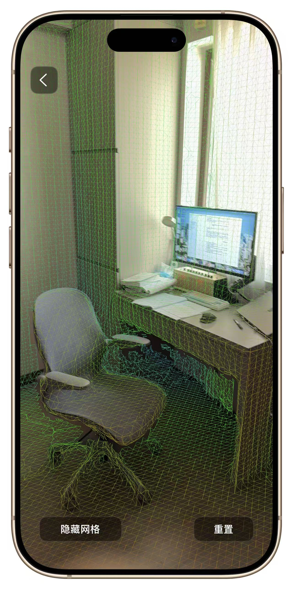
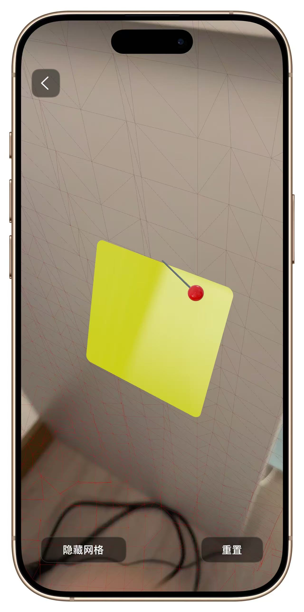
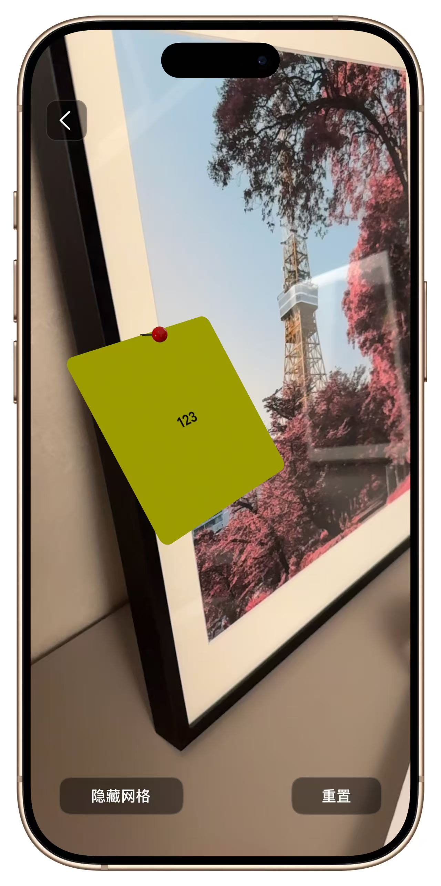

# AR Sticky Notes for Room Scans

An iOS AR app for scanning a room, restoring its spatial map later, and attaching sticky notes directly to real-world surfaces.

This project started from Apple sample code and was extended into a personal prototype focused on room persistence and note-based interaction.

## What It Does

- Scan a room with `RoomPlan` and save its `ARWorldMap`.
- Reopen a saved room and relocalize back into the same space.
- Place sticky notes on real surfaces in AR.
- Attach either text or an image to a note.
- Save notes per room and restore them on the next visit.
- Manage saved rooms with rename and delete actions.

## Demo Flow

1. Start a new room scan.
2. Move the device until mapping is ready.
3. Save the room.
4. Re-enter the saved room later.
5. Add or edit AR sticky notes anchored to the environment.

## Screenshots

### Mesh Visualization

### Ray-Plane Intersection

### Sticky Notes Effect

### Demo video

***(Click the image above to watch the video demonstration)***

**The video demonstrates the core workflow:**
* **Mapping & Anchoring:** Scanning a new room environment and placing AR sticky notes.
* **Spatial Persistence:** Re-entering the previously saved room to successfully reload and locate the anchored labels.

## Tech Stack

- Swift
- UIKit
- ARKit
- RealityKit
- RoomPlan

## Requirements

- Xcode 15 or later recommended
- iOS device with LiDAR
- iOS 16 or later for `RoomPlan`

## Project Structure

- `VisualizingSceneSemantics/`: main application source
- `VisualizingSceneSemantics.xcodeproj/`: Xcode project
- `Documentation/`: screenshots and reference images
- `Configuration/`: local project configuration

## Open Source Notes

- This repository contains derivative work based on Apple sample code.
- Apple copyright and license terms are preserved in [LICENSE.txt](LICENSE.txt).
- Additional attribution details are documented in [NOTICE.md](NOTICE.md).
- A separate Apple reference sample exists locally in `CreateA3DModelOfAnInteriorRoomByGuidingTheUserThroughAnARExperience/` and is ignored by Git so it is not uploaded by accident.

## Build

Open `VisualizingSceneSemantics.xcodeproj` in Xcode and run the `Visualizing Scene Semantics` scheme on a physical iOS device.

## Why This Repo Exists

This is my first personal open source project on GitHub. The goal is to explore how room reconstruction, relocalization, and lightweight AR annotations can work together in a practical note-taking workflow.
